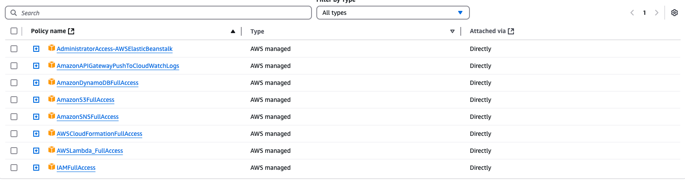

# Energy Metrics Data Pipeline Deployment Guide

## Prerequisites
- AWS Account
- AWS CLI installed
- Python 3.8+

## Deployment Workflow

### 1. AWS User Setup

- Create IAM user with programmatic access
- Attach necessary permissions:
  - AmazonS3FullAccess
  - AWSLambdaFullAccess
  - AmazonDynamoDBFullAccess
  - CloudFormationFullAccess

### 2. AWS CLI Configuration
```bash
# Install AWS CLI
# https://docs.aws.amazon.com/cli/latest/userguide/getting-started-install.html

# Configure AWS Credentials
aws configure
# Enter Access Key ID
# Enter Secret Access Key
# Default region (us-east-1)
# Default output format (json)
```

### 3. Project Setup
```bash
# Clone Repository
git clone <your-repo-url>
cd energy-metrics-pipeline

# Create Virtual Environment
python3 -m venv venv
source venv/bin/activate

# Install Dependencies
pip install -r requirements.txt
```

### 4. S3 Bucket Preparation
- Choose unique bucket name: `my-s3-energy-data-bucket`
- Region: `us-east-1`

### 5. CloudFormation Deployment
```bash
# Deploy Infrastructure
aws cloudformation create-stack \
  --stack-name energy-pipeline \
  --template-body file://cloudformation.yaml \
  --parameters ParameterKey=NotificationBucket,ParameterValue=my-s3-energy-data-bucket \
  --region us-east-1 \
  --capabilities CAPABILITY_IAM \
  --tags Key=project,Value=energy-metrics
```

### 6. Verify CloudFormation Resources
- Open AWS CloudFormation Console
- Check `energy-pipeline` stack
- Review created resources in the `"Resources"` tab

### 7. Data Simulator Deployment
```bash
# Run Data Simulator
python data_simulator.py
```

### 8. FastAPI Backend
```bash
# Run API Server
uvicorn app:app --reload
```

### 9. Streamlit Dashboard
```bash
# Launch Dashboard
streamlit run dashboard.py
```

### 10. SNS Anomaly Notifications
#### This component was manually added after the initial CloudFormation deployment
#### Otherwise, I would have included it into to the CloudFormation stack as well.
- Create SNS Topic: `Anomaly-Detection-Topic`
- Configure Lambda permissions
- Add email/SMS subscriptions as needed

### 11. Monitoring & Logging
- Check CloudWatch Logs
- Monitor Lambda function
- Review DynamoDB metrics

### 12. Cleanup
```bash
# Delete CloudFormation Stack
aws cloudformation delete-stack \
  --stack-name energy-pipeline \
  --region us-east-1
```

## Deployment Variations

### Local Development
- Use `.env` for configuration
- Mock AWS services locally

### Production Deployment
- Use AWS Elastic Beanstalk
- Configure CI/CD pipeline
- Implement proper IAM roles

## Estimated Costs
- Lambda: Free tier available
- DynamoDB: Minimal costs
- S3: Inexpensive storage
- SNS: Very low cost

## Additional Resources
- [AWS Documentation](https://docs.aws.amazon.com)
- [Serverless Framework](https://www.serverless.com)
- [AWS Well-Architected Framework](https://aws.amazon.com/architecture/well-architected/)

